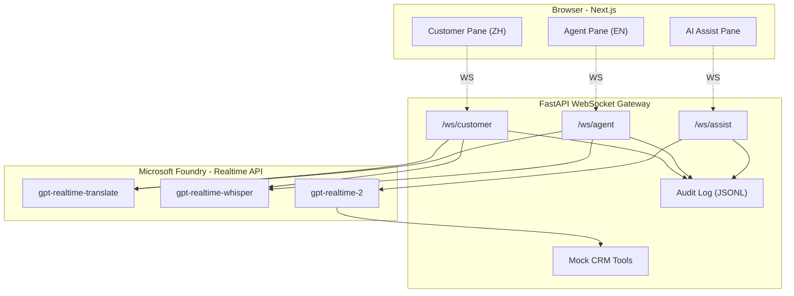

# Contact Center on GPT-Realtime

> 一个**全球客服呼叫中心** Demo 的设计蓝本 —— 串联 Microsoft Foundry 上三款全新音频模型（`gpt-realtime-translate`、`gpt-realtime-whisper`、`gpt-realtime-2`），在一通跨语种电话里完成「双向同传 + 合规留底 + 复杂推理升级」。


---

## 🚧 项目状态

**这是一个规划/设计仓库（Planning & Spec only）** —— 当前只有方案文档，**还没有代码**。
代码实现由 issue / PR 推进中，欢迎参与贡献。

完整方案见 [`docs/`](./docs/)。

---

## ✨ 这个 Demo 在演示什么

```
┌──────────────────────────────────────────────────────────────┐
│  中国客户致电英国总部售后                                       │
│                                                              │
│  客户（中文）──┬──> [gpt-realtime-translate] ──> 坐席（英文）   │
│               │                                              │
│               └──> [gpt-realtime-whisper]   ──> 中文原文存档   │
│                                                              │
│  复杂咨询升级 ─────> [gpt-realtime-2]                          │
│                      reasoning.effort=high                   │
│                      + mock CRM 工具调用                       │
│                      + 128K 上下文                            │
└──────────────────────────────────────────────────────────────┘
```

完整的 6 步业务脚本见 [`docs/02-business-scenario.md`](./docs/02-business-scenario.md)。

---

## 🏗️ 架构一览



详细架构与时序图见 [`docs/03-architecture.md`](./docs/03-architecture.md)。

---

## 🧩 功能要点

- 🎙️ **浏览器麦克风实时输入**（AudioWorklet, PCM16 @ 24 kHz）
- 🌐 **中文 ↔ 英文双向连续同传**，由 `gpt-realtime-translate` 驱动
- 📝 **并行原文流式转写**（`gpt-realtime-whisper`），用于合规留底
- 🧠 **复杂问题升级**到 `gpt-realtime-2`，支持 `reasoning.effort` 四档与工具调用
- 🛠️ **Mock CRM 工具**：`get_order` / `check_tariff` / `check_insurance`
- 🖥️ **三栏工作台 UI**：客户面板（中）｜ 坐席面板（英）｜ AI 助理（推理 trace）
- 📦 **本地 docker-compose** + **Azure Container Apps 一键部署**（`azd up`）
- 📊 **完整合规留底**：原文 / 译文 / 推理 trace 写入 JSONL（云上可落地 Blob）

---

## 📚 文档导航

| 章节 | 内容 |
|------|------|
| [01 — Overview](./docs/01-overview.md) | 三模型背景、为什么要串起来、目标人群 |
| [02 — Business Scenario](./docs/02-business-scenario.md) | 6 步业务脚本、UI wireframe、路演口径 |
| [03 — Architecture](./docs/03-architecture.md) | 系统图、Mermaid 时序图、关键设计要点 |
| [04 — Tech Stack](./docs/04-tech-stack.md) | 技术选型、目录树、依赖清单、编码规范 |
| [05 — Implementation Plan](./docs/05-implementation-plan.md) | 6 阶段路线图、20 个 todos、依赖关系图 |
| [06 — Deployment](./docs/06-deployment.md) | 本地 docker-compose、Azure `azd up`、环境变量、清理 |
| [07 — Cost Estimate](./docs/07-cost-estimate.md) | 三模型计费、单通通话成本、月度估算、优化建议 |
| [08 — Risks & Mitigations](./docs/08-risks-and-mitigations.md) | 风险矩阵 |
| [09 — Acceptance Criteria](./docs/09-acceptance-criteria.md) | 验收标准、Demo 黄金路径 |
| [10 — Future Extensions](./docs/10-future-extensions.md) | 真实 CRM、SIP、Entra ID、可观测性等 |
| [11 — API Contract](./docs/11-api-contract.md) | WS 协议契约、TS / Python 类型全集、错误码 |
| [12 — Realtime Session Config](./docs/12-realtime-session-config.md) | 三模型 `session.update` 完整 payload 与字段说明 |
| [13 — Mock Data & Tools](./docs/13-mock-data-and-tools.md) | 三个 mock CRM 工具的 schema、fixture、dispatcher |
| [14 — Frontend Design](./docs/14-frontend-design.md) | 三栏 UI、Zustand 状态、AudioWorklet、WS 客户端 |
| [15 — Demo Script](./docs/15-demo-script.md) | 8 分钟金路径、逐字稿、风险预案、Q&A 预备 |

---

## 💰 成本提示

三模型计费方式不同（translate 按 token、whisper 与 realtime-2 按音频分钟）。一通典型 5 分钟跨境通话粗估 **~ $0.5 – $1.0**。
详细测算见 [`docs/07-cost-estimate.md`](./docs/07-cost-estimate.md)。

---

## 🛣️ Roadmap

- [x] Phase 0 — 规划与文档（本仓库当前状态）
- [ ] Phase 1 — 项目脚手架（FastAPI + Next.js）
- [ ] Phase 2 — 三模型 smoke test 脚本
- [ ] Phase 3 — WebSocket 网关 + Mock 工具
- [ ] Phase 4 — 前端工作台 + 麦克风
- [ ] Phase 5 — 端到端联调
- [ ] Phase 6 — 容器化 + Azure 部署（`azd up`）

详见 [`docs/05-implementation-plan.md`](./docs/05-implementation-plan.md)。

---

## 🎙️ Smoke tests — 验证三模型连通性（Phase 2）

每个 Foundry Realtime 部署都有独立的 smoke 脚本，无需启动整个 backend / frontend，
直接确认 `session.update` 通过、首字延迟达标、输出可播放。

### 准备

```bash
cd backend
cp .env.example .env       # 填入 AZURE_OPENAI_ENDPOINT / API_KEY / DEPLOYMENT_*
pip install -e .
# 准备一段中文 wav（mono · 16-bit · 24kHz pcm），见 scripts/audio-samples/README.md
```

### 运行

```bash
# #4 translate — 双向口译
python -m scripts.smoke_translate scripts/audio-samples/cs_zh_01.wav --out out_translate.wav

# #5 whisper — 流式转写（开发中）
python -m scripts.smoke_whisper scripts/audio-samples/cs_zh_01.wav

# #6 assistant — 推理 + 工具调用（开发中）
python -m scripts.smoke_assistant --order A12345
```

通过判据：脚本退出码 0，且打印的 `first_audio_ms < 1000`。

---

## 🤝 Contributing

仓库当前处于规划阶段。如果你想参与代码实现：

1. 阅读 [`docs/`](./docs/) 下的全部文档以理解设计意图
2. 在 Issues 中认领一个 Phase 或 todo
3. 提 PR 前请讨论实现细节以避免大改

---

## 📄 License

[MIT](./LICENSE) © 2026 turbo998

---

## 🙏 Acknowledgements

- **OpenAI** — 三款 GPT-realtime 音频模型
- **Microsoft Foundry / Azure AI Foundry** — 模型托管与 Realtime API
- **Azure Container Apps** — 部署目标
