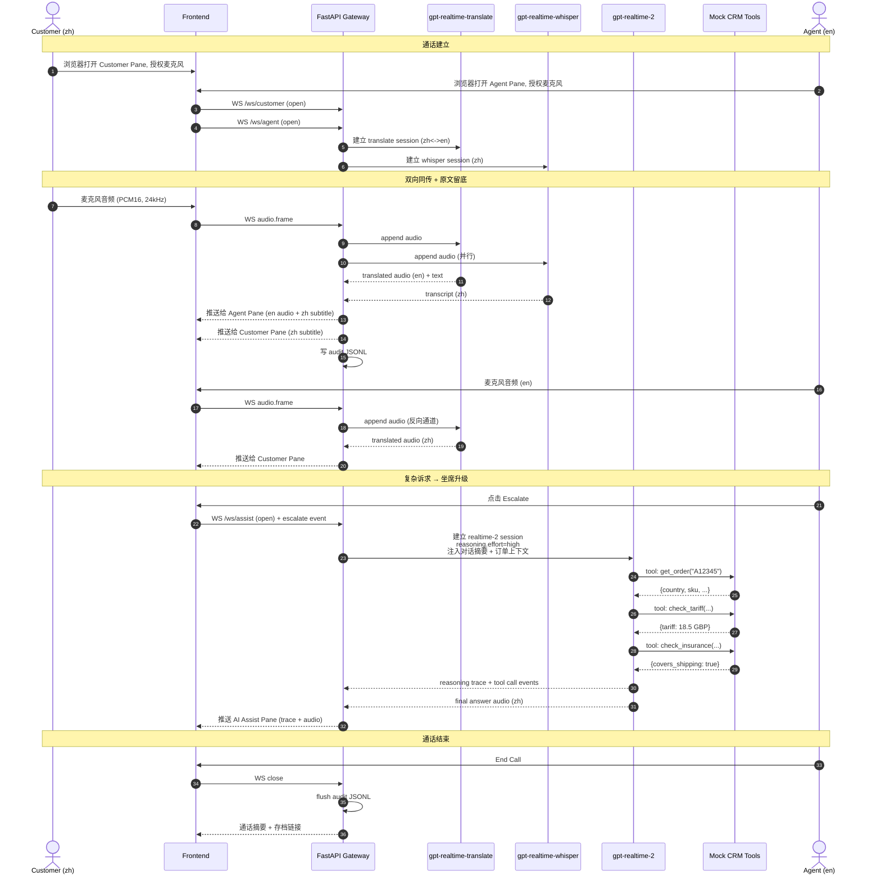

# 03 · Architecture

## 3.1 总体架构

```
┌──────────────────────────────────────────────────────────────────────┐
│                         Browser (Next.js)                            │
│  ┌──────────────┐  ┌──────────────┐  ┌──────────────────────────┐    │
│  │ Customer Pane│  │  Agent Pane  │  │ AI Assist (realtime-2)   │    │
│  │  🎤 中文输入  │  │  🎤 英文输入  │  │  推理链 + 工具调用 trace  │    │
│  │  🔊 中文译文  │  │  🔊 英文译文  │  │  Escalate 按钮          │    │
│  │  📝 原文字幕  │  │  📝 译文字幕  │  │                          │    │
│  └──────┬───────┘  └──────┬───────┘  └─────────┬────────────────┘    │
│         │ WS               │ WS                │ WS                  │
└─────────┼──────────────────┼───────────────────┼─────────────────────┘
          │                  │                   │
          ▼                  ▼                   ▼
┌──────────────────────────────────────────────────────────────────────┐
│              FastAPI Backend (WebSocket gateway)                     │
│  ┌────────────────┐  ┌────────────────┐  ┌──────────────────────┐    │
│  │ /ws/customer   │  │ /ws/agent      │  │ /ws/assist           │    │
│  │  ├ translate   │  │  ├ translate   │  │  └ realtime-2        │    │
│  │  └ whisper(并行)│  │  └ whisper(并行)│  │     + tools (mock)   │    │
│  └────────┬───────┘  └────────┬───────┘  └──────────┬───────────┘    │
│           │                   │                     │                │
│           │ Realtime API (WSS)                      │                │
│           ▼                   ▼                     ▼                │
│  ┌──────────────────────────────────────────────────────────────┐    │
│  │           Microsoft Foundry — Realtime API                   │    │
│  │  gpt-realtime-translate │ gpt-realtime-whisper │ gpt-rt-2     │    │
│  └──────────────────────────────────────────────────────────────┘    │
│                                                                      │
│  ┌────────────────────────────────────────────────────────────────┐  │
│  │ Session Store (in-memory dict, 可选 Azure Cache for Redis)     │  │
│  │ + Audit Log (JSONL → 可选 Azure Blob Storage)                  │  │
│  └────────────────────────────────────────────────────────────────┘  │
└──────────────────────────────────────────────────────────────────────┘
```

## 3.2 通话生命周期时序图



## 3.3 六大设计决策

### D1. 三条独立 WebSocket 通道
**决策**：`/ws/customer`、`/ws/agent`、`/ws/assist` 三条独立 WS，每条对应到不同的 Foundry Realtime 会话。
**理由**：
- 故障隔离 —— 一个会话断开不影响另两个
- 演示直观 —— UI 三栏一一对应，便于路演讲解
- 计费可观测 —— 后台可按通道分别统计 token / 分钟

### D2. 音频管道：PCM16 / 24 kHz
**决策**：浏览器 AudioWorklet 采集 PCM16 单声道 @ 24 kHz，base64 编码经 WS 传给后端，后端转发到 Foundry。
**理由**：
- Realtime API 原生支持，**零转码**
- 24 kHz 单声道 ≈ 48 kbps，对 WS 压力极低
- AudioWorklet 比 ScriptProcessorNode 延迟更低更稳

### D3. translate 与 whisper 并行
**决策**：同一份客户/坐席音频 fork 给两个独立 Realtime 会话。
**理由**：
- translate 输出的是**译文**，无法满足合规对**原文**留底的要求
- 两路并行延迟独立，互不阻塞
- 任一路出错，另一路仍可用，体验降级而不崩溃

### D4. 升级机制：手动 Escalate
**决策**：坐席点击按钮触发升级，而非 AI 自动判断。
**理由**：
- 演示易于讲解，触发时机可控
- 把"自动升级"留给 v2（基于情绪 + 复杂度评分）
- 升级时把**最近 N 秒对话摘要 + 订单上下文**注入 `session.update`，realtime-2 即拥有完整背景

### D5. Mock CRM 工具（in-process）
**决策**：用 FastAPI 内的纯函数模拟三个工具：`get_order` / `check_tariff` / `check_insurance`，通过 Realtime API function calling 暴露给 realtime-2。
**理由**：
- Demo 自洽，**零外部依赖**
- 工具签名设计模拟真实 CRM，方便后续替换为真接口
- 在 UI 上可观察工具调用全链路（参数 / 返回 / 耗时）

### D6. 合规留底：JSONL
**决策**：每通通话生成一份 `audit-{call_id}.jsonl`，每行一条事件：
```json
{"ts": 1748131234.567, "channel": "customer", "type": "whisper.transcript",
 "text": "你好，我上周买的咖啡机收到时漏水…"}
{"ts": 1748131245.890, "channel": "assist", "type": "rt2.tool_call",
 "name": "get_order", "args": {"order_id": "A12345"}}
```
**理由**：
- JSONL 流式追加成本低
- 易于离线分析、长期归档
- 本地写文件、云上可一键改成 Append Blob

## 3.4 数据流（音频 / 文本 / 工具）

```
音频流 (PCM16 24kHz):
  Mic → AudioWorklet → WS → FastAPI → Foundry Realtime API
                                   ← (translated audio) ← 
                                   ← (transcript text) ←

文本流 (JSON):
  Foundry → FastAPI → WS → React state → UI 字幕组件

工具调用 (function calling):
  Foundry (rt-2) → tool_call event → FastAPI dispatcher
                                   → call mock function
                                   → tool_response event → Foundry
                  ↓
                  → WS → UI (trace panel)

合规事件 (audit):
  每个 transcript / translate / tool_call → JSONL append
```

## 3.5 后端模块边界

| 模块 | 职责 | 关键接口 |
|------|------|----------|
| `app.realtime.translate` | 维护到 `gpt-realtime-translate` 的 WS 连接 | `async def connect(src, dst)` / `async def push_audio(frame)` |
| `app.realtime.whisper` | 维护到 `gpt-realtime-whisper` 的 WS 连接 | `async def connect(lang)` / `async def push_audio(frame)` |
| `app.realtime.assistant` | 维护到 `gpt-realtime-2` 的 WS 连接 + 工具调度 | `async def start(context)` / `async def push_audio(frame)` |
| `app.tools.mock_crm` | 三个 mock 函数 + JSON Schema | `get_order` / `check_tariff` / `check_insurance` |
| `app.ws.{customer,agent,assist}` | 浏览器侧 WS 端点 | `async def endpoint(ws, call_id)` |
| `app.session_store` | 通话会话状态（in-memory） | `get_session` / `put_session` / `remove_session` |
| `app.audit.logger` | JSONL 追加（本地 / Blob） | `async def log(event)` |

## 3.6 部署拓扑（云端）

```
                  Azure Front Door / Azure App Gateway (可选)
                                │ HTTPS / WSS
                                ▼
       ┌────────────────────────────────────────────────────┐
       │       Azure Container Apps Environment             │
       │  ┌────────────────────┐   ┌────────────────────┐   │
       │  │ Container App:     │   │ Container App:     │   │
       │  │   frontend (Next)  │   │   backend (FastAPI)│   │
       │  │   Ingress: ext     │   │   Ingress: ext WSS │   │
       │  └────────────────────┘   └─────────┬──────────┘   │
       └─────────────────────────────────────┼──────────────┘
                                             │ Managed Identity
                                             ▼
                                ┌─────────────────────────┐
                                │  Foundry / OpenAI 资源   │
                                │  (Cognitive Services    │
                                │   User role assigned)   │
                                └─────────────────────────┘
                                             │
                                             ▼
                                ┌─────────────────────────┐
                                │  (可选) Blob Storage    │
                                │  audit-{id}.jsonl       │
                                └─────────────────────────┘
```

---

下一步：[04-tech-stack.md](./04-tech-stack.md) 了解技术选型与目录结构。
