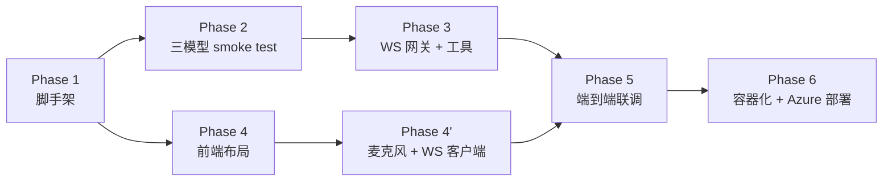
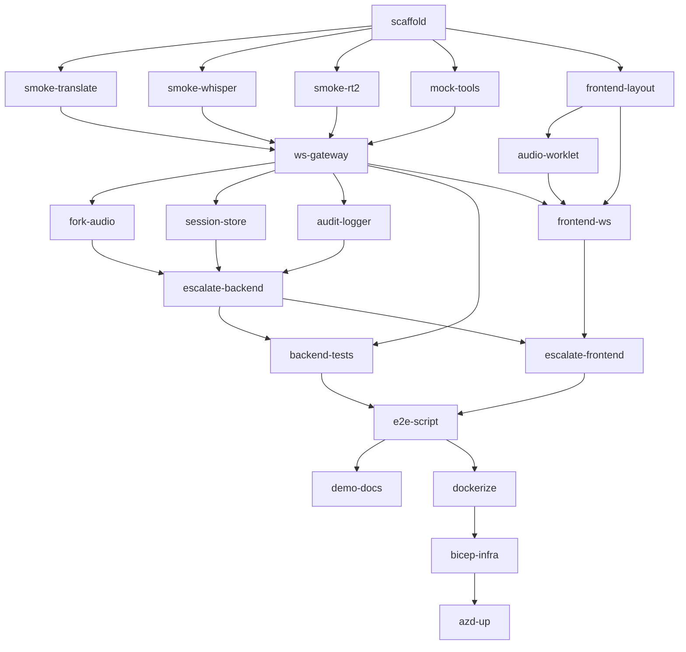

# 05 · Implementation Plan

## 5.1 整体路线图

- **Phase 1**：项目脚手架
- **Phase 2**：三个独立 smoke test 脚本，证明三模型连通性
- **Phase 3**：FastAPI WS 网关 + Mock CRM 工具
- **Phase 4**：Next.js 三栏工作台 + 浏览器麦克风采集
- **Phase 5**：端到端联调，跑通 6 步业务脚本
- **Phase 6**：容器化、Bicep、`azd up` 部署到 Azure Container Apps

## 5.2 详细 Todo 列表（20 项）

> ID 用 kebab-case；状态：⬜ pending / 🟦 in_progress / ✅ done / 🟥 blocked

| ID | 标题 | 输入 | 产出 | 验证 |
|----|------|------|------|------|
| **scaffold** | 项目脚手架 | 仓库根目录、Phase 1 设计 | `pyproject.toml` / `package.json` / `.env.example` / `docker-compose.yml` / 基本 README | `pip install -e backend/[dev]` + `npm i` 通过 |
| **smoke-translate** | translate smoke test | 一段中文 wav | 英文译文音频 + 文本 | 听感正确、首字延迟 < 1s |
| **smoke-whisper** | whisper smoke test | 一段中文 wav | 流式中文转写 | 字幕实时滚动、终态字幕完整 |
| **smoke-rt2** | realtime-2 smoke test | 一句音频问题 + 系统提示 | 音频回答 + 推理 trace | 音频自然、trace 非空 |
| **mock-tools** | Mock CRM 工具 | 工具签名设计 | `get_order` / `check_tariff` / `check_insurance` + JSON Schema | pytest 通过 |
| **ws-gateway** | WebSocket 网关 | 三模型客户端 + 工具 | `/ws/customer` `/ws/agent` `/ws/assist` 三端点 | wscat 手测能收发 |
| **fork-audio** | 音频双路 fork | WS 网关 | 客户/坐席音频同时进 translate 和 whisper | 两路同时出结果，延迟独立 |
| **escalate-backend** | 后端升级逻辑 | WS 网关 + 会话存储 | Escalate 事件触发 realtime-2 + 注入上下文 | 单测 + 端到端能触发 |
| **session-store** | 会话存储 | 通话元数据 | in-memory dict + 接口 | 多并发通话不互串 |
| **audit-logger** | 合规留底 | 所有事件 | `audit-{id}.jsonl` 本地落地 | 6 步脚本结束后文件完整 |
| **backend-tests** | 后端单测 | 各模块 | pytest 覆盖 ≥ 70% | `pytest` 全绿 |
| **frontend-layout** | 三栏 UI | 设计稿 | `page.tsx` + 三个 Pane 组件 | 视觉对齐 wireframe |
| **audio-worklet** | 麦克风采集 | UI | `audio-worklet-processor.js` + `lib/audio-worklet.ts` | 控制台能看到 PCM 帧 |
| **frontend-ws** | 前端 WS 客户端 | UI + 麦克风 | 三条 WS 连接、消息分发 | 字幕实时更新 |
| **escalate-frontend** | Escalate 按钮 | 前端 WS | 按钮 + Assist Pane 激活 | 点击后 trace 面板有内容 |
| **e2e-script** | 端到端联调 | 全栈 | 跑通 6 步脚本 | 首音延迟 < 1.5s、合规文件完整 |
| **demo-docs** | 演示文档 | 联调结果 | `docs/demo-script.md`（口径）+ 录屏 | 团队评审通过 |
| **dockerize** | 容器化 | 全栈 | 两个 Dockerfile + 完整 docker-compose | `docker compose up` 重现联调 |
| **bicep-infra** | IaC | 部署目标 | `infra/main.bicep` + modules | `az bicep build` 通过 |
| **azd-up** | 一键云部署 | Bicep + 镜像 | `azd up` 走通 + 云端冒烟 | 云端 URL 复现 6 步脚本 |

## 5.3 Todo 依赖图

## 5.4 Phase 验收门禁

每个 Phase 结束前，必须满足以下条件才能进入下一阶段：

### Phase 1 → Phase 2
- [ ] `backend/` 能 `python -c "import app"` 不报错
- [ ] `frontend/` 能 `npm run build` 通过
- [ ] `.env.example` 已写满模板

### Phase 2 → Phase 3
- [ ] 三个 smoke test 脚本独立运行，**都能收到模型输出**
- [ ] 首音延迟实测：translate < 1s、whisper < 0.5s、rt-2 (effort=medium) < 2s

### Phase 3 → Phase 5（合并跳过 Phase 4，前端可并行做）
- [ ] WS 网关三端点能用 wscat 联通
- [ ] 同一份音频能 fork 到 translate + whisper，两路都出结果
- [ ] Escalate 事件能正确触发 realtime-2 并注入上下文
- [ ] `pytest` 全绿

### Phase 4 → Phase 5
- [ ] 三栏 UI 视觉完成
- [ ] 浏览器能采集到 24kHz PCM16 帧并推到 WS

### Phase 5 → Phase 6
- [ ] 完整跑通 [02-business-scenario.md](./02-business-scenario.md) 的 6 步脚本
- [ ] `audit-*.jsonl` 包含所有事件
- [ ] 首音延迟 < 1.5s

### Phase 6 → Done
- [ ] `azd up` 成功部署
- [ ] 云端 URL 能复现 6 步脚本
- [ ] `azd down --purge` 能干净清理

## 5.5 调试与开发建议

| 场景 | 建议 |
|------|------|
| 首次连通 Foundry | 用 `smoke-*.py` 脚本，避免 WS 网关把问题复杂化 |
| 排查音频延迟 | 在 backend 加埋点：`mic → ws → foundry`、`foundry → ws → speaker` 两段分别计时 |
| 排查 turn-taking | 打开 Realtime API 服务端日志，观察 `input_audio_buffer.committed` / `response.created` |
| 排查工具调用 | rt-2 的 `response.function_call_arguments.delta` 事件流可在 trace panel 实时显示 |
| 演示前 dry-run | 跑 3 遍完整脚本，每遍换不同语句，确保模型表现稳定 |

## 5.6 Issue / PR 模板建议

- 每个 todo 对应一个 GitHub Issue，title 形如 `[Phase 3] ws-gateway: implement /ws/customer`
- Issue body 引用本文件锚点：`See: docs/05-implementation-plan.md#section-5-2`
- PR 命名：`feat(phase-3): customer ws endpoint` / `fix(audio): worklet sample rate`

---

下一步：[06-deployment.md](./06-deployment.md) 看如何把它跑起来 / 部署上云。
