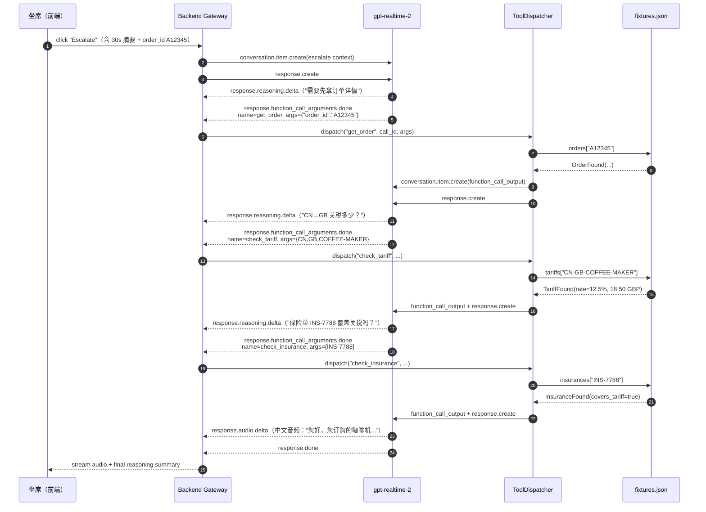

# 13 · Mock 数据与工具实现

> 本文档定义 rt-2 在 escalate 流程里会调用的三个"假"CRM 工具：
> `get_order` / `check_tariff` / `check_insurance`。
> 这三个工具是 demo 的"业务大脑"——rt-2 的推理链全靠它们的返回值收敛到一个具体方案。

---

## 13.1 概览与设计取舍

### 为什么是 mock？

本项目的核心是演示 **gpt-realtime + gpt-realtime-mini 在客服场景下的实时编排能力**，不是一个真实的跨境电商 CRM。把工具实现做成 mock，有三点好处：

1. **零外部依赖**：跑 demo 不需要 SAP / Salesforce / 自建订单库的 sandbox，`docker compose up` 就能跑完整 escalate 流程。
2. **可重复演示**：fixture 固定三个订单号（A12345 / B67890 / D55555），现场演示永远走同一条幸福路径，避免 "上次还好好的，今天 sandbox 又抽风" 的尴尬。
3. **聚焦点正确**：观众的注意力应在 rt-2 的 reasoning / tool_call 时序上，而不是 OAuth / 鉴权 / 字段映射。

### 为什么用 JSON fixture，不直接 hardcode？

- **可读**：fixture 是一份完整的 JSON，运营同事看一眼就懂"这次演示讲的是什么订单"。
- **可换皮**：如果想拍 v2 demo（比如换成奢侈品退货场景），只需要替换 `fixtures.json`，Python 代码一行不用动。
- **测试友好**：单元测试可以加载一份临时 fixture，覆盖 not_found 等分支。

### 未来如何切到真实 CRM？

工具的 Python 实现遵循 **"一个 async 函数 + 一份 TypedDict 返回类型"** 的契约。要换成真实后端，只需要：

| 步骤 | 操作 |
|---|---|
| ① | 保留 `app/tools/schema.py`（TypedDict 与 JSON Schema 不变） |
| ② | 把 `app/tools/impl.py` 里读 fixture 的逻辑换成 `httpx.AsyncClient` 调真实 API |
| ③ | 用 `app/tools/dispatcher.py` 不变（dispatcher 只关心契约，不关心实现） |
| ④ | 在 `.env` 加 `CRM_BASE_URL` / `CRM_API_KEY`，删除 `MOCK_FIXTURES_PATH` |

也就是说，**rt-2 / dispatcher / WebSocket 网关都不需要改**——这是 mock-first 设计带来的最大收益。

---

## 13.2 Fixture 格式

文件：`backend/app/tools/fixtures.json`（已落地，**本文档不修改**）。

顶层三个 key 对应三个工具的数据源：

```jsonc
{
  "orders":     { "<order_id>":  { ...OrderRecord    } },
  "tariffs":    { "<from>-<to>-<sku>": { ...TariffRecord } },
  "insurances": { "<policy_id>": { ...InsuranceRecord } }
}
```

### Schema 摘要

| 节 | Key 形式 | 关键字段 |
|---|---|---|
| `orders` | `order_id`（如 `A12345`） | `sku`, `product_name`, `from_country`, `to_country`, `status`, `amount`, `currency`, `insurance_policy_id` |
| `tariffs` | `{from}-{to}-{sku}`（如 `CN-GB-COFFEE-MAKER`） | `rate_percent`, `amount`, `currency`, `basis` |
| `insurances` | `policy_id`（如 `INS-7788`） | `covers_shipping`, `covers_tariff`, `covers_replacement`, `deductible`, `valid_until` |

### 内置的三个演示订单

| order_id | 商品 | 路径 | 状态 | 保险单 | 演示用途 |
|---|---|---|---|---|---|
| **A12345** | Premium Drip Coffee Maker | CN → GB | `delivered_damaged` | `INS-7788`（全保） | **主路径**：损坏件 + 全保 → rt-2 建议直接换货免运费 |
| **B67890** | Smart Kettle 1.7L | CN → DE | `in_transit` | `INS-0001`（基础险） | 备选路径：未到货 + 基础险 → rt-2 给出"等待 + 关税自付"建议 |
| **D55555** | Ultrabook 14" | US → DE | `delivered` | `INS-2002`（仅运费） | 边界场景：已签收 + 关税 0% → rt-2 解释 WTO 免税并拒绝重复理赔 |

> 三条订单覆盖了 "状态分支 × 保险分支 × 关税分支" 的笛卡尔乘积里最有戏剧性的三个组合。

---

## 13.3 Tool 1 · `get_order`

### JSON Schema（与 docs/12 §12.4 一致）

```jsonc
{
  "type": "function",
  "name": "get_order",
  "description": "查询订单详情。返回订单的 sku、收货国、发货国、状态、金额。",
  "parameters": {
    "type": "object",
    "properties": {
      "order_id": { "type": "string", "description": "订单号，例如 A12345" }
    },
    "required": ["order_id"],
    "additionalProperties": false
  }
}
```

### Python 签名

```python
# backend/app/tools/impl.py
from typing import TypedDict, Literal, Optional

class OrderFound(TypedDict):
    found: Literal[True]
    order_id: str
    sku: str
    product_name: str
    from_country: str
    to_country: str
    status: str
    amount: float
    currency: str
    ordered_at: str
    delivered_at: Optional[str]
    customer_id: str
    insurance_policy_id: Optional[str]
    notes: Optional[str]

class NotFound(TypedDict):
    found: Literal[False]
    reason: Literal["not_found"]
    query: dict

OrderResult = OrderFound | NotFound

async def get_order(order_id: str) -> OrderResult: ...
```

### 行为

1. 加载 `fixtures.json`（进程启动时 lazy-load 一次，缓存到模块级 `_FIXTURES`）。
2. `await asyncio.sleep(random.uniform(0.1, 0.3))` 模拟真实 CRM 的网络延迟（**100–300 ms**），让 rt-2 的 reasoning timeline 看起来更真实。
3. 在 `_FIXTURES["orders"]` 里按 `order_id` 精确匹配。
4. 命中：返回 `{"found": True, ...record}`；未命中：返回 `{"found": False, "reason": "not_found", "query": {"order_id": order_id}}`。

### 错误案例

| 输入 | 返回 |
|---|---|
| `"A12345"` | `OrderFound` 全字段 |
| `"X99999"` | `NotFound` |
| `""` / `None` | dispatcher 层会先做参数校验，直接返回 `{"error": "invalid_arguments"}` |
| fixture 文件缺失 | 启动时 fail-fast，不进入运行期 |

---

## 13.4 Tool 2 · `check_tariff`

### JSON Schema

```jsonc
{
  "type": "function",
  "name": "check_tariff",
  "description": "查询某 SKU 从一个国家到另一个国家的关税金额（GBP）。",
  "parameters": {
    "type": "object",
    "properties": {
      "from_country": { "type": "string", "description": "ISO 3166-1 alpha-2 国家码，如 CN" },
      "to_country":   { "type": "string", "description": "ISO 3166-1 alpha-2 国家码，如 GB" },
      "sku":          { "type": "string", "description": "商品 SKU，如 COFFEE-MAKER" }
    },
    "required": ["from_country", "to_country", "sku"],
    "additionalProperties": false
  }
}
```

### Python 签名

```python
class TariffFound(TypedDict):
    found: Literal[True]
    from_country: str
    to_country: str
    sku: str
    rate_percent: float
    amount: float
    currency: str
    basis: str

TariffResult = TariffFound | NotFound

async def check_tariff(from_country: str, to_country: str, sku: str) -> TariffResult: ...
```

### 行为

1. 同样 100–300 ms 模拟延迟。
2. 拼装 key：`f"{from_country.upper()}-{to_country.upper()}-{sku.upper()}"`。
3. 命中 `_FIXTURES["tariffs"]`：返回 `TariffFound`；否则返回 `NotFound`（`query` 字段携带三个参数，便于前端 timeline 显示）。

### 错误案例

| 输入 | 返回 |
|---|---|
| `("CN","GB","COFFEE-MAKER")` | `rate_percent=12.5, amount=18.50 GBP` |
| `("CN","FR","COFFEE-MAKER")` | `NotFound`（fixture 没有 FR 路径） |
| 大小写混合 `("cn","gb","coffee-maker")` | 命中（实现统一 `.upper()`） |

---

## 13.5 Tool 3 · `check_insurance`

### JSON Schema

```jsonc
{
  "type": "function",
  "name": "check_insurance",
  "description": "查询保险单是否覆盖跨境运费或关税。",
  "parameters": {
    "type": "object",
    "properties": {
      "policy_id": { "type": "string", "description": "保险单号，如 INS-7788" }
    },
    "required": ["policy_id"],
    "additionalProperties": false
  }
}
```

### Python 签名

```python
class InsuranceFound(TypedDict):
    found: Literal[True]
    policy_id: str
    customer_id: str
    covers_shipping: bool
    covers_tariff: bool
    covers_replacement: bool
    deductible: float
    currency: str
    valid_until: str
    notes: Optional[str]

InsuranceResult = InsuranceFound | NotFound

async def check_insurance(policy_id: str) -> InsuranceResult: ...
```

### 行为

与 `get_order` 同构：100–300 ms 延迟 → `_FIXTURES["insurances"][policy_id]` 查表 → 命中或 `NotFound`。

### 错误案例

| 输入 | 返回 |
|---|---|
| `"INS-7788"` | 全保（覆盖运费/关税/换货） |
| `"INS-0001"` | 基础险（仅覆盖换货，30 EUR 免赔额） |
| `"INS-9999"` | `NotFound` |

---

## 13.6 后端 Tool Dispatcher

dispatcher 是 rt-2 WebSocket 处理循环与 Python 工具实现之间的胶水。它的输入来自 rt-2 的 `response.function_call_arguments.done` 事件，输出是一条 `conversation.item.create`（`type=function_call_output`）再追一个 `response.create`，让 rt-2 把工具结果纳入下一轮 reasoning。

### 类骨架

```python
# backend/app/tools/dispatcher.py
import asyncio
import json
import logging
from typing import Any, Awaitable, Callable

from app.tools.impl import get_order, check_tariff, check_insurance

log = logging.getLogger(__name__)

ToolFn = Callable[..., Awaitable[dict[str, Any]]]

class ToolDispatcher:
    """Dispatch rt-2 function calls to local async implementations.

    Wire-up:
        rt-2 → response.function_call_arguments.done(name, call_id, arguments_json)
             ↓
        ToolDispatcher.dispatch(name, call_id, arguments_json)
             ↓
        rt-2 ← conversation.item.create(type=function_call_output, call_id, output)
        rt-2 ← response.create   # ask the model to continue reasoning
    """

    TIMEOUT_SECONDS: float = 5.0

    def __init__(self, send_to_rt2: Callable[[dict], Awaitable[None]]):
        self._send = send_to_rt2
        self._registry: dict[str, ToolFn] = {
            "get_order":       get_order,
            "check_tariff":    check_tariff,
            "check_insurance": check_insurance,
        }

    async def dispatch(self, name: str, call_id: str, arguments_json: str) -> None:
        try:
            args = json.loads(arguments_json or "{}")
        except json.JSONDecodeError as exc:
            await self._reply(call_id, {"error": "invalid_json", "detail": str(exc)})
            return

        fn = self._registry.get(name)
        if fn is None:
            await self._reply(call_id, {"error": "unknown_tool", "name": name})
            return

        log.info("tool.dispatch", extra={"tool": name, "call_id": call_id, "args": args})

        try:
            result = await asyncio.wait_for(fn(**args), timeout=self.TIMEOUT_SECONDS)
        except asyncio.TimeoutError:
            await self._reply(call_id, {"error": "timeout", "limit_s": self.TIMEOUT_SECONDS})
            return
        except TypeError as exc:  # bad arg shape
            await self._reply(call_id, {"error": "invalid_arguments", "detail": str(exc)})
            return
        except Exception as exc:  # noqa: BLE001
            log.exception("tool.failed", extra={"tool": name})
            await self._reply(call_id, {"error": "internal", "detail": repr(exc)})
            return

        await self._reply(call_id, result)

    async def _reply(self, call_id: str, output: dict) -> None:
        await self._send({
            "type": "conversation.item.create",
            "item": {
                "type": "function_call_output",
                "call_id": call_id,
                "output": json.dumps(output, ensure_ascii=False),
            },
        })
        # nudge rt-2 to keep reasoning with the new tool result
        await self._send({"type": "response.create"})
```

### 关键设计点

- **5 s 超时**：mock 实现最多 300 ms，留 5 s 是给未来真实 CRM 的余量；超时一律以结构化错误回传 rt-2，让模型自己决定降级话术。
- **错误也走 `function_call_output`**：不要静默丢弃，否则 rt-2 会一直 `tool_choice: required` 卡死。错误对象有 `{"error": "..."}` 字段，prompt 里告诉 rt-2 看到 `error` 就向客户道歉并请坐席接管。
- **`response.create` 紧跟其后**：根据 Realtime API 协议，提交 `function_call_output` 并不会自动触发下一轮生成，需要显式 `response.create`。
- **registry 是注入点**：未来加新工具，只需在 `_registry` 加一行 + 写一个 async 函数。

---

## 13.7 escalate 流程里工具如何被串起来

以主路径订单 **A12345** 为例：



> 整条链路里 dispatcher 一共往 rt-2 投递了 **3 × (function_call_output + response.create) = 6** 条事件，每次都让 rt-2 在新增上下文上继续推理，最终收敛到一条 80–150 字的中文方案。

---

## 13.8 加一个新工具的 5 步清单

假设要加 `check_shipping_eta(order_id) -> {eta_date, carrier}`：

1. **Fixture**：在 `fixtures.json` 加 `"shippings": { "A12345": { ... } }`。
2. **Schema**：在 `app/tools/impl.py` 新增 `ShippingResult` TypedDict + `async def check_shipping_eta(...)`，沿用 100–300 ms 模拟延迟与 `NotFound` 形状。
3. **Registry**：在 `ToolDispatcher._registry` 加一行 `"check_shipping_eta": check_shipping_eta`。
4. **rt-2 session**：在 `app/realtime/rt2_session.py` 的 `tools` 数组里追加 JSON Schema，并在 `instructions` 里写明何时调用（例如"客户问『什么时候到』时调用"）。
5. **测试**：在 `tests/test_tools.py` 加 happy / not_found / timeout 三个 case；在 `scripts/smoke-rt2.py` 跑一遍 escalate，确认新工具出现在 reasoning timeline。

---

## 13.9 验收（供 issue 引用）

- [ ] `backend/app/tools/fixtures.json` 存在，包含 `orders` / `tariffs` / `insurances` 三个顶层 key，每个至少 3 条记录
- [ ] `A12345` / `B67890` / `D55555` 三个订单号可被 `get_order` 命中，返回字段与本文 §13.2 表格一致
- [ ] `get_order("X99999")` 返回 `{"found": False, "reason": "not_found", "query": {...}}`
- [ ] `check_tariff("cn","gb","coffee-maker")`（任意大小写）命中 `CN-GB-COFFEE-MAKER`
- [ ] `check_insurance("INS-7788")` 返回 `covers_tariff=True`
- [ ] 每个工具调用包含 100–300 ms 的 `asyncio.sleep` 模拟延迟
- [ ] `ToolDispatcher.dispatch` 在 5 s 内不返回时，向 rt-2 回传 `{"error":"timeout"}` 而非抛异常
- [ ] dispatcher 在每次 `function_call_output` 之后紧跟一个 `response.create`
- [ ] 未知工具名返回 `{"error":"unknown_tool", "name": "..."}`，无 JSON 时返回 `{"error":"invalid_json", ...}`
- [ ] `scripts/smoke-rt2.py` 注入 A12345 后，timeline 至少出现 3 次 `function_call_arguments.done`，最终产出中文音频

---

下一篇：[14-frontend-design.md](./14-frontend-design.md) 看前端的页面布局、状态机与 WebSocket 客户端如何把这些 reasoning / tool_call 事件渲染成坐席能看懂的实时 UI。
