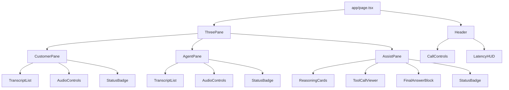

# 14. 前端设计（Frontend Design）

> 本章定义 Demo 前端的实现规范：Next.js 14（App Router）+ TypeScript + Tailwind CSS，单页三栏布局：**Customer（中文客户）**、**Agent（英文坐席）**、**AI Assist（推理 Trace）**。前端同时承担音频采集、播放、WebSocket 信令与状态可视化职责。

适用范围：`frontend/` 子目录。设计原则——**单页、可分屏、可观测、零后端状态**（所有持久状态来自后端事件流）。

---

## 14.1 Layout & Routes

### 14.1.1 路由结构

采用 App Router，单页应用：

```
frontend/
├── app/
│   ├── layout.tsx          # 全局 HTML/Tailwind/字体注入
│   ├── page.tsx            # 三栏主页（唯一业务页面）
│   ├── globals.css         # Tailwind base + 自定义滚动条
│   └── api/                # 仅保留 /api/health 探活
└── lib/                    # audio / ws / store
```

`app/page.tsx` 是唯一业务页面。其他路径（如 `/admin`、`/debug`）暂不实现，留作 V2 扩展。

### 14.1.2 URL 参数：分屏与角色

为便于演示与端到端测试，主页支持 `?role=` 查询参数：

| 参数值 | 渲染内容 | 用途 |
|---|---|---|
| `?role=both`（默认） | 同时渲染三栏 | 单屏 Demo / 评审 |
| `?role=customer` | 仅 CustomerPane（占满全宽） | 客户端独立窗口 |
| `?role=agent` | AgentPane + AssistPane（2 栏） | 坐席工位 |

读取逻辑（`app/page.tsx` 顶部）：

```ts
'use client';
import { useSearchParams } from 'next/navigation';

export default function Page() {
  const role = (useSearchParams().get('role') ?? 'both') as 'both' | 'customer' | 'agent';
  return <ThreePane role={role} />;
}
```

### 14.1.3 响应式栅格

`ThreePane` 使用 CSS Grid：

| 视口宽度 | 布局 | Tailwind 类 |
|---|---|---|
| ≥ 1280 px (`xl`) | 3 列等宽，固定高度 100vh | `xl:grid-cols-3 xl:h-screen` |
| < 1280 px | 单列纵向堆叠，可滚动 | `grid-cols-1 min-h-screen` |

```tsx
<main className="grid grid-cols-1 xl:grid-cols-3 xl:h-screen gap-px bg-slate-200">
  {showCustomer && <CustomerPane />}
  {showAgent && <AgentPane />}
  {showAssist && <AssistPane />}
</main>
```

`gap-px bg-slate-200` 让三栏之间形成 1px 分隔线，无需额外 border。

---

## 14.2 Component Tree



### 14.2.1 共享组件

| 组件 | 文件 | 职责 |
|---|---|---|
| `Header` | `components/Header.tsx` | 顶栏：通话控制按钮、延迟 HUD、Build 版本 |
| `TranscriptList` | `components/TranscriptList.tsx` | 滚动列表，按时间升序，自动滚到底 |
| `AudioControls` | `components/AudioControls.tsx` | Mic 开关、音量条、设备选择 |
| `StatusBadge` | `components/StatusBadge.tsx` | WS 连接 / 录音 / 播放状态点 |
| `ReasoningCards` | `components/ReasoningCards.tsx` | 推理步骤折叠卡片 |
| `ToolCallViewer` | `components/ToolCallViewer.tsx` | 工具调用 JSON 可展开 |

---

## 14.3 State Management（Zustand）

使用 Zustand 而非 Redux：体量小、SSR 友好、无 Provider 包装。Store 拆分为 3 个 slice，由 `lib/store/index.ts` 合并。

### 14.3.1 类型定义

`lib/store/types.ts`：

```ts
// ---------- callSlice ----------
export type CallStatus = 'idle' | 'connecting' | 'live' | 'ended' | 'error';

export interface CallState {
  callId: string | null;
  status: CallStatus;
  startedAt: number | null;     // epoch ms
  endedAt: number | null;
  error: string | null;
}

export interface CallActions {
  startCall: (callId: string) => void;
  setStatus: (s: CallStatus) => void;
  endCall: () => void;
  setError: (msg: string) => void;
}

// ---------- transcriptSlice ----------
export type Speaker = 'customer' | 'agent';
export type Lang = 'zh' | 'en';

export interface Utterance {
  id: string;                   // uuid
  speaker: Speaker;
  lang: Lang;
  text: string;
  isFinal: boolean;
  translation?: string;         // 译文（另一种语言）
  startMs: number;              // 相对 call.startedAt
  endMs?: number;
}

export interface TranscriptState {
  utterances: Utterance[];
}

export interface TranscriptActions {
  upsertUtterance: (u: Utterance) => void;
  appendDelta: (id: string, deltaText: string, kind: 'text' | 'translation') => void;
  finalize: (id: string) => void;
  clear: () => void;
}

// ---------- assistSlice ----------
export interface ReasoningStep {
  id: string;
  index: number;
  summary: string;              // 一句话总结
  detail?: string;              // 详细文本（折叠时隐藏）
  startedAt: number;
  endedAt?: number;
}

export interface ToolCall {
  id: string;
  name: string;
  args: Record<string, unknown>;
  result?: unknown;
  status: 'pending' | 'success' | 'error';
  startedAt: number;
  endedAt?: number;
}

export interface AssistState {
  reasoning: ReasoningStep[];
  toolCalls: ToolCall[];
  finalText: string;
  audioPlaying: boolean;
}

export interface AssistActions {
  addReasoning: (step: ReasoningStep) => void;
  updateReasoning: (id: string, patch: Partial<ReasoningStep>) => void;
  addToolCall: (tc: ToolCall) => void;
  updateToolCall: (id: string, patch: Partial<ToolCall>) => void;
  appendFinalText: (delta: string) => void;
  setAudioPlaying: (b: boolean) => void;
  resetAssist: () => void;
}

export type RootStore =
  CallState & CallActions &
  TranscriptState & TranscriptActions &
  AssistState & AssistActions;
```

### 14.3.2 Store 组装

`lib/store/index.ts`（示意）：

```ts
import { create } from 'zustand';
import { devtools } from 'zustand/middleware';
import { createCallSlice } from './callSlice';
import { createTranscriptSlice } from './transcriptSlice';
import { createAssistSlice } from './assistSlice';

export const useStore = create<RootStore>()(
  devtools((...a) => ({
    ...createCallSlice(...a),
    ...createTranscriptSlice(...a),
    ...createAssistSlice(...a),
  }), { name: 'cc-store' })
);
```

组件通过选择器订阅，避免不必要重渲染：

```ts
const utterances = useStore(s => s.utterances);
const status = useStore(s => s.status);
```

---

## 14.4 Audio Capture（AudioWorklet）

浏览器原生 `getUserMedia` 默认采样率多为 48 kHz，需要降采样到后端要求的 **24 kHz 单声道 PCM16**，并按 **20 ms（480 samples）** 切帧推送。

文件 `frontend/lib/audio/recorder-worklet.ts`：

```ts
// AudioWorkletProcessor — 在 AudioWorkletGlobalScope 运行，单独线程
// 输入：浏览器 AudioContext 采样率（通常 48000Hz，单声道）
// 输出：24kHz PCM16，每帧 20ms = 480 samples = 960 bytes
class RecorderProcessor extends AudioWorkletProcessor {
  static get parameterDescriptors() { return []; }

  private readonly TARGET_RATE = 24000;
  private readonly FRAME_SAMPLES = 480;            // 20ms @ 24kHz
  private ratio = sampleRate / this.TARGET_RATE;   // sampleRate is global
  private resampleBuf: number[] = [];
  private srcCursor = 0;

  process(inputs: Float32Array[][]): boolean {
    const input = inputs[0]?.[0];
    if (!input) return true;

    // Linear interpolation downsample
    for (; this.srcCursor < input.length; this.srcCursor += this.ratio) {
      const i = Math.floor(this.srcCursor);
      const frac = this.srcCursor - i;
      const a = input[i] ?? 0;
      const b = input[i + 1] ?? a;
      this.resampleBuf.push(a + (b - a) * frac);
    }
    this.srcCursor -= input.length;

    // Emit fixed 20ms frames
    while (this.resampleBuf.length >= this.FRAME_SAMPLES) {
      const chunk = this.resampleBuf.splice(0, this.FRAME_SAMPLES);
      const pcm16 = new Int16Array(this.FRAME_SAMPLES);
      for (let i = 0; i < this.FRAME_SAMPLES; i++) {
        const s = Math.max(-1, Math.min(1, chunk[i]));
        pcm16[i] = s < 0 ? s * 0x8000 : s * 0x7fff;
      }
      this.port.postMessage(pcm16.buffer, [pcm16.buffer]);
    }
    return true;
  }
}

registerProcessor('recorder-processor', RecorderProcessor);
```

主线程接入（`lib/audio/recorder.ts`）：

```ts
const ctx = new AudioContext({ sampleRate: 48000 });
await ctx.audioWorklet.addModule('/worklets/recorder-worklet.js');
const stream = await navigator.mediaDevices.getUserMedia({
  audio: { channelCount: 1, echoCancellation: true, noiseSuppression: true }
});
const src = ctx.createMediaStreamSource(stream);
const node = new AudioWorkletNode(ctx, 'recorder-processor');
node.port.onmessage = (e) => ws.send({ type: 'audio.frame', pcm: e.data });
src.connect(node);
```

> `recorder-worklet.ts` 需在构建期复制到 `public/worklets/recorder-worklet.js`（Next 不会处理 worklet 模块）。可在 `next.config.js` 中通过 webpack 复制插件或 `postbuild` 脚本完成。

---

## 14.5 Audio Playback（PCMPlayer）

后端通过 `translate.audio.delta` / `rt2.audio.delta` 推送 PCM16 24 kHz 块。前端需要：
1. 顺序拼接进 `AudioBuffer`；
2. 维护 **100 ms jitter buffer** 抗抖动；
3. 使用 `AudioBufferSourceNode` 按时间线 `start(when)` 排队播放。

`frontend/lib/audio/player.ts`：

```ts
export interface PCMPlayerOpts {
  sampleRate?: number;      // default 24000
  jitterMs?: number;        // default 100
  onUnderrun?: () => void;
  onPlayingChange?: (playing: boolean) => void;
}

export class PCMPlayer {
  private ctx: AudioContext;
  private sampleRate: number;
  private jitterSec: number;
  private nextStartTime = 0;          // AudioContext.currentTime 坐标系
  private queueDepth = 0;
  private opts: PCMPlayerOpts;

  constructor(opts: PCMPlayerOpts = {}) {
    this.opts = opts;
    this.sampleRate = opts.sampleRate ?? 24000;
    this.jitterSec = (opts.jitterMs ?? 100) / 1000;
    this.ctx = new AudioContext({ sampleRate: this.sampleRate });
  }

  /** 推入一块 PCM16 (ArrayBuffer)；按 jitter 排队 */
  enqueue(pcm16: ArrayBuffer): void {
    const i16 = new Int16Array(pcm16);
    const f32 = new Float32Array(i16.length);
    for (let i = 0; i < i16.length; i++) f32[i] = i16[i] / 0x8000;

    const buf = this.ctx.createBuffer(1, f32.length, this.sampleRate);
    buf.copyToChannel(f32, 0);

    const src = this.ctx.createBufferSource();
    src.buffer = buf;
    src.connect(this.ctx.destination);

    const now = this.ctx.currentTime;
    const startAt = Math.max(this.nextStartTime, now + this.jitterSec);
    src.start(startAt);
    this.nextStartTime = startAt + buf.duration;

    this.queueDepth++;
    this.opts.onPlayingChange?.(true);
    src.onended = () => {
      if (--this.queueDepth === 0) {
        this.opts.onPlayingChange?.(false);
        if (this.ctx.currentTime > this.nextStartTime) this.opts.onUnderrun?.();
      }
    };
  }

  /** 立即停止并清空 */
  reset(): void {
    this.nextStartTime = 0;
    this.queueDepth = 0;
    // 关闭并重建 ctx 以中止所有在途 source
    this.ctx.close();
    this.ctx = new AudioContext({ sampleRate: this.sampleRate });
  }

  async resume(): Promise<void> { await this.ctx.resume(); }
}
```

> 注意：用户首次交互前调用 `resume()`，否则浏览器会以 `suspended` 状态启动。

---

## 14.6 WebSocket Client

`frontend/lib/ws/client.ts` 提供统一的 WS 抽象：

- 自动重连：指数退避 **1s → 2s → 4s → 8s（上限）**；
- 心跳：每 **15 s** 发送 `{ type: 'ping' }`，若 20s 内无响应则主动断开重连；
- 消息信封：遵循 `docs/11 §11.1.1`，统一 `{ type, callId, seq, ts, payload }`；
- 二进制帧（音频）走同一 socket，`binaryType = 'arraybuffer'`，由 `onMessage` 判别 `event.data instanceof ArrayBuffer`。

```ts
export interface WsEnvelope<T = unknown> {
  type: string;
  callId?: string;
  seq?: number;
  ts: number;
  payload?: T;
}

export interface WsClientOpts {
  url: string;
  onMessage: (msg: WsEnvelope | ArrayBuffer) => void;
  onError?: (err: Event | Error) => void;
  onStatus?: (s: 'connecting' | 'open' | 'closed') => void;
}

export interface WsClient {
  send: (msg: WsEnvelope | ArrayBuffer) => void;
  close: () => void;
}

export function createWsClient(opts: WsClientOpts): WsClient {
  const BACKOFF = [1000, 2000, 4000, 8000];
  let attempt = 0;
  let ws: WebSocket | null = null;
  let pingTimer: ReturnType<typeof setInterval> | null = null;
  let pongDeadline = 0;
  let closedByUser = false;
  let seq = 0;

  const connect = () => {
    opts.onStatus?.('connecting');
    ws = new WebSocket(opts.url);
    ws.binaryType = 'arraybuffer';

    ws.onopen = () => {
      attempt = 0;
      opts.onStatus?.('open');
      pongDeadline = Date.now() + 20000;
      pingTimer = setInterval(() => {
        if (Date.now() > pongDeadline) { ws?.close(); return; }
        ws?.send(JSON.stringify({ type: 'ping', ts: Date.now(), seq: ++seq }));
      }, 15000);
    };

    ws.onmessage = (ev) => {
      if (ev.data instanceof ArrayBuffer) { opts.onMessage(ev.data); return; }
      try {
        const msg = JSON.parse(ev.data) as WsEnvelope;
        if (msg.type === 'pong') { pongDeadline = Date.now() + 20000; return; }
        opts.onMessage(msg);
      } catch (e) { opts.onError?.(e as Error); }
    };

    ws.onerror = (e) => opts.onError?.(e);

    ws.onclose = () => {
      if (pingTimer) { clearInterval(pingTimer); pingTimer = null; }
      opts.onStatus?.('closed');
      if (closedByUser) return;
      const delay = BACKOFF[Math.min(attempt, BACKOFF.length - 1)];
      attempt++;
      setTimeout(connect, delay);
    };
  };

  connect();

  return {
    send: (msg) => {
      if (!ws || ws.readyState !== WebSocket.OPEN) return;
      if (msg instanceof ArrayBuffer) ws.send(msg);
      else ws.send(JSON.stringify({ ...msg, seq: ++seq, ts: msg.ts ?? Date.now() }));
    },
    close: () => { closedByUser = true; ws?.close(); },
  };
}
```

---

## 14.7 Pane Specs

### 14.7.1 CustomerPane（中文客户）

**展示内容：**
- 顶部：客户头像 + 「中文 · 客户」标识 + StatusBadge（mic / ws）
- 中部：`TranscriptList`，气泡两类
  - 自说（蓝色右对齐）：来自 `whisper.transcript.delta/final`（zh，speaker=customer）
  - 译入（灰色左对齐）：来自 `translate.text.delta`（direction=`agent_to_customer`，目标语 zh）
- 底部：`AudioControls`（开始/结束通话、麦克风开关）

**消费事件：**
| Event | 行为 |
|---|---|
| `whisper.transcript.delta` (speaker=customer) | `upsertUtterance` / `appendDelta(kind=text)` |
| `whisper.transcript.final` (speaker=customer) | `finalize(id)` |
| `translate.text.delta` (dir=agent_to_customer) | 新增/追加 agent utterance 的 `translation` 字段 |
| `translate.audio.delta` (dir=agent_to_customer) | `customerPlayer.enqueue(pcm)` |

**发出事件（→ Customer WS）：**
| Event | 触发 |
|---|---|
| `call.start` | 点击「开始通话」 |
| `audio.frame` (PCM16 binary) | AudioWorklet 每 20 ms |
| `call.end` | 点击「结束通话」或离开页面 |

### 14.7.2 AgentPane（英文坐席）

**展示内容：** 与 CustomerPane 对称，绿色主题。
- 自说（绿色右对齐）：`whisper.transcript.*`（en，speaker=agent）
- 译入（灰色左对齐）：`translate.text.delta`（direction=`customer_to_agent`，目标语 en）

**消费事件：**
| Event | 行为 |
|---|---|
| `whisper.transcript.*` (speaker=agent) | 同上 |
| `translate.text.delta` (dir=customer_to_agent) | 追加 customer utterance.translation |
| `translate.audio.delta` (dir=customer_to_agent) | `agentPlayer.enqueue(pcm)` |

**发出事件（→ Agent WS）：** `call.start` / `audio.frame` / `call.end`，与 CustomerPane 镜像。

### 14.7.3 AssistPane（AI 推理 Trace）

**展示内容：** 紫色主题，三段：
1. **Reasoning Cards**：每条 `ReasoningStep` 一张折叠卡片，默认显示 `summary`，点击展开 `detail`；右上角显示耗时；
2. **Tool Call Viewer**：表格 + 可展开 JSON（使用 `react-json-view-lite`）。状态点（pending=黄/success=绿/error=红）；
3. **Final Answer**：流式追加的纯文本块 + 播放按钮（如有 audio）。

**消费事件（来自 Agent WS 的 `rt2.*` 转发）：**
| Event | 行为 |
|---|---|
| `rt2.reasoning.delta` | `addReasoning` / `updateReasoning` |
| `rt2.tool.call` | `addToolCall(status=pending)` |
| `rt2.tool.result` | `updateToolCall(status, result)` |
| `rt2.text.delta` | `appendFinalText` |
| `rt2.audio.delta` | `assistPlayer.enqueue(pcm)`；`setAudioPlaying(true)` |
| `rt2.done` | 收尾：`setAudioPlaying(false)`（依赖 player 回调） |

**发出事件（→ Agent WS）：**
| Event | 触发 |
|---|---|
| `assist.start` | 坐席点击「请求 AI 协助」 |
| `assist.end` | 坐席点击「停止」或自动到 `rt2.done` 后清理 |
| `escalate.request` | 坐席点击「升级人工」按钮，附上当前 reasoning/toolCalls 快照 |

---

## 14.8 Styling

### 14.8.1 Tailwind 配置

`tailwind.config.ts` 扩展 theme，定义三色语义 token：

```ts
extend: {
  colors: {
    customer: { 50:'#eff6ff', 500:'#3b82f6', 700:'#1d4ed8' }, // blue
    agent:    { 50:'#ecfdf5', 500:'#10b981', 700:'#047857' }, // emerald
    assist:   { 50:'#f5f3ff', 500:'#8b5cf6', 700:'#6d28d9' }, // violet
  },
  fontFamily: {
    sans: ['Inter', 'PingFang SC', 'Microsoft YaHei', 'sans-serif'],
    mono: ['JetBrains Mono', 'Menlo', 'monospace'],
  }
}
```

### 14.8.2 Pane 颜色规范

| 元素 | Customer | Agent | Assist |
|---|---|---|---|
| Pane 顶栏背景 | `bg-customer-50` | `bg-agent-50` | `bg-assist-50` |
| 主题强调 | `text-customer-700` | `text-agent-700` | `text-assist-700` |
| 自说气泡 | `bg-customer-500 text-white` | `bg-agent-500 text-white` | — |
| 译文气泡 | `bg-slate-100 text-slate-700` | 同 | — |
| StatusBadge OK | `bg-emerald-500` | 同 | 同 |

### 14.8.3 排版与间距

- 字号：气泡正文 `text-base`，时间戳/元数据 `text-xs text-slate-400`；
- 圆角统一 `rounded-2xl`，气泡 `rounded-2xl` + `px-4 py-2`；
- 阴影：卡片 `shadow-sm`，悬浮 `hover:shadow-md transition`；
- 暗色模式：V2 实现，本期仅亮色。

---

## 14.9 Accessibility & i18n

### 14.9.1 ARIA

- 每个 Pane 用 `<section role="region" aria-label="...">` 包裹；
- `TranscriptList` 使用 `role="log" aria-live="polite" aria-relevant="additions"`，新增 utterance 由屏幕阅读器自动播报；
- AudioControls 按钮均带 `aria-label`（如 `aria-label="开始通话"`）；
- 折叠卡片用 `<button aria-expanded="true|false" aria-controls="...">` + `<div id="..." role="region">`。

### 14.9.2 语言标记

- HTML `<html lang="zh-CN">`；
- CustomerPane 内文本节点添加 `lang="zh"`，AgentPane 添加 `lang="en"`，AssistPane 默认 `lang="zh"` 但 final answer 按实际语言切换；
- 输入法/语音识别提示：mic 按钮 tooltip 区分「请讲中文」/「Speak English」。

### 14.9.3 键盘操作

| 快捷键 | 行为 |
|---|---|
| `Space` | 切换 mic 静音（焦点在 AudioControls 时） |
| `Esc` | 结束通话（带确认弹窗） |
| `Ctrl/Cmd + K` | 打开 AI Assist 请求 |

---

## 14.10 Acceptance Criteria

- [ ] `pnpm dev` 在本地 3000 端口启动，无 TypeScript / ESLint 错误；
- [ ] 访问 `/` 默认渲染三栏；`?role=customer` / `?role=agent` 正确分屏；
- [ ] 视口宽度从 1920 缩到 800，布局从 3 列平滑切换为单列纵向堆叠；
- [ ] CustomerPane 录音 5 秒后，AgentPane 1.5 秒内显示英文译文且 AgentPane player 播放 TTS；反向亦然；
- [ ] AudioWorklet 输出帧大小恒为 480 samples (960 bytes)，连续 30 秒无丢帧（DevTools 计数）；
- [ ] PCMPlayer 在网络抖动（人工 200 ms jitter）下无可闻爆音；underrun 计数 < 2 次/分钟；
- [ ] WebSocket 在断网/恢复后 ≤ 8 秒自动重连成功；UI StatusBadge 反映状态变化；
- [ ] 坐席点击「AI 协助」后，AssistPane 在 1 秒内开始流式渲染 reasoning，工具调用 JSON 可展开；
- [ ] Lighthouse Accessibility ≥ 90；axe-core 自动扫描无 critical issue；
- [ ] 三色语义 token 在所有组件中无硬编码 hex 颜色（lint 规则校验）。

---

**下一章 →** [`15-demo-script.md`](./15-demo-script.md)
